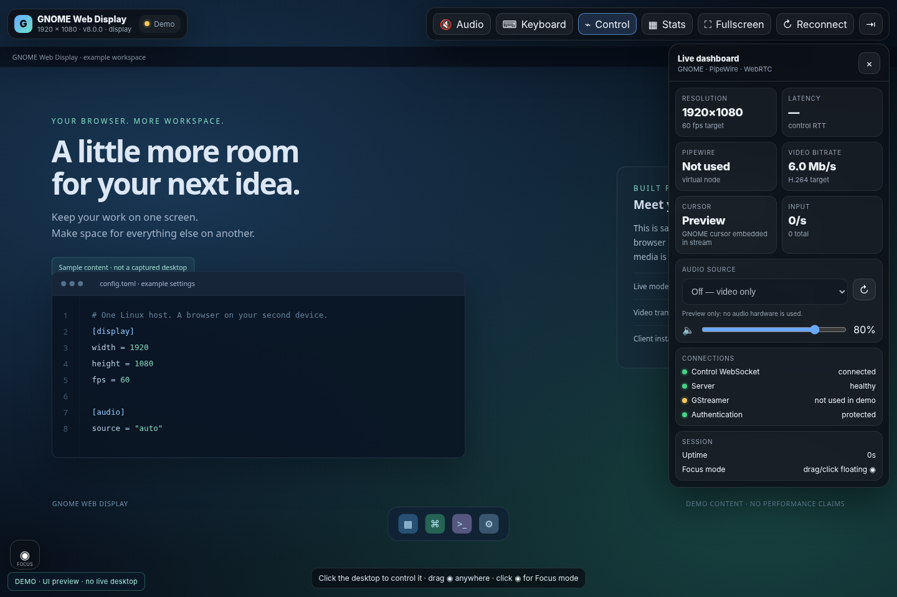
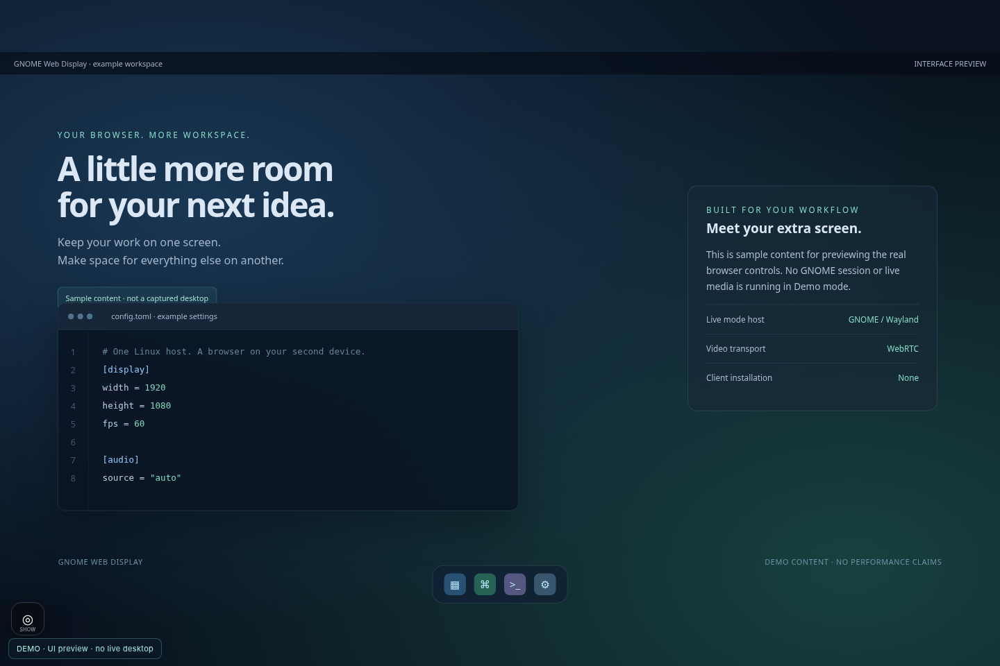
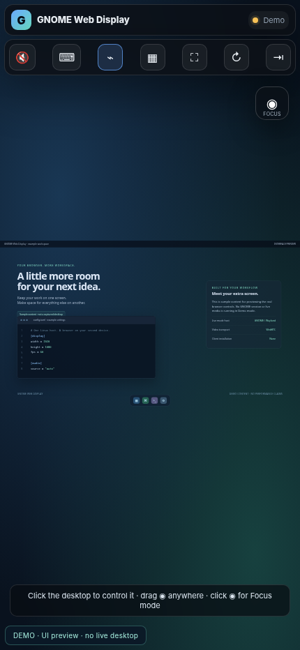
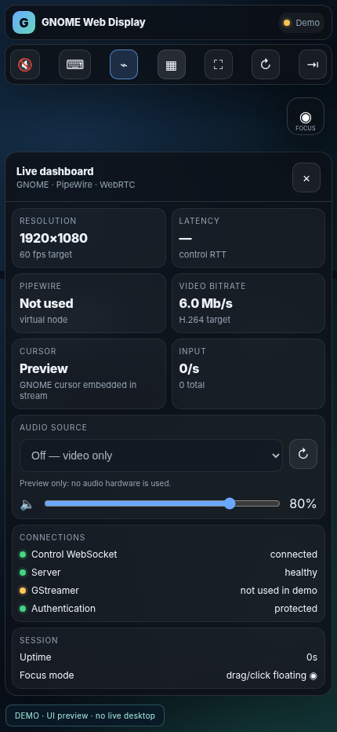
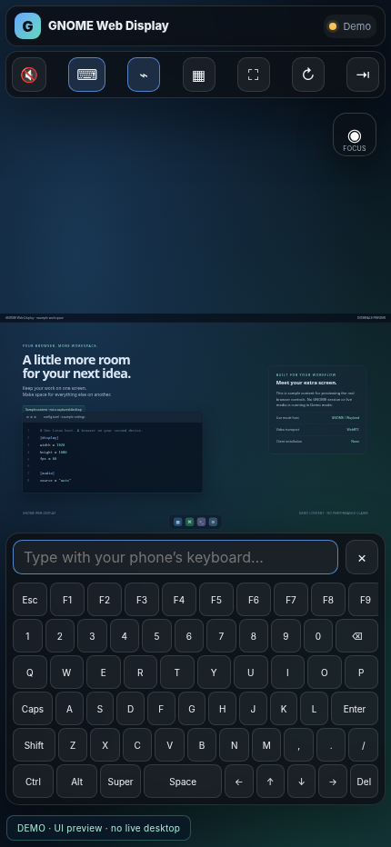
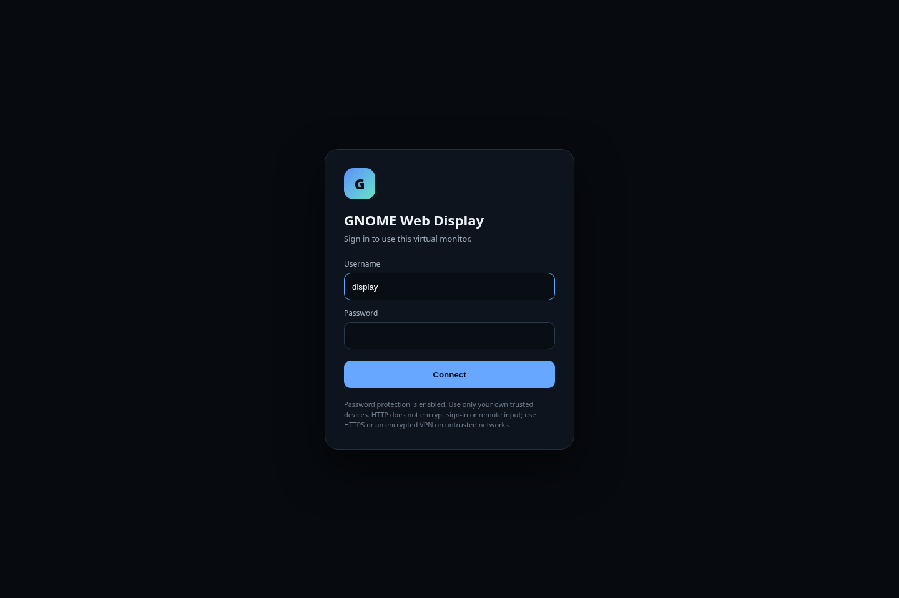

<div align="center">

# GNOME Web Display

### Your browser. An extra screen for Linux.

A **spacedesk-style alternative for GNOME on Wayland**: use a phone, tablet,
laptop, or another computer as a browser-based extended display.

**Virtual monitor · WebRTC video · System audio · Mouse & keyboard · No client app**

[Get started](#get-started) · [Screenshots](#screenshots) · [Settings](#settings) ·
[Troubleshooting](#troubleshooting) · [Developer guide](README-dev.md)

</div>



> **Screenshot disclosure:** the images in this repository are browser-rendered
> previews of the actual interface, using **Demo/mock status and sample workspace
> content**. They are not photographs, live GNOME captures, or evidence of measured
> streaming performance. See [how they were made](docs/SCREENSHOTS.md).

## What it does

GNOME Web Display requests a virtual monitor from Mutter, captures it through
PipeWire, and delivers H.264 video and optional Opus audio to your browser. The
browser also sends mouse, touch-as-pointer, wheel, and keyboard input back to the host.

This is an **extra monitor**, not a new independent desktop session. Arrange it in
**GNOME Settings → Displays**, then move windows onto it just as you would with a
physical display. Every connected viewer sees the same virtual monitor.

It is an independent project, not affiliated with spacedesk or GNOME. It is not a
protocol-compatible spacedesk client or a universal replacement for its features.

### Highlights

- **A browser instead of a client install.** Responsive controls for desktops,
  tablets, and phones, with fullscreen and a draggable Focus button.
- **Display and control together.** Embedded host cursor, physical/virtual
  keyboard, sticky modifiers, and a field for your device's native keyboard.
- **Audio you choose.** Default system-output audio, an explicit host input, or
  video-only mode. Change the source from the dashboard.
- **A more helpful startup.** Dependency checks, explicit installation prompts,
  configuration validation, occupied-port checks, and actionable errors.

## Requirements and compatibility

| Component | Requirement / scope |
| --- | --- |
| Host desktop | A logged-in **GNOME Wayland** session with Mutter ScreenCast and RemoteDesktop APIs |
| Baseline | **Debian 13 + GNOME 48** is the original project's target, not a claim of hardware certification for this release |
| Installer | Debian/Ubuntu with APT; package availability and desktop compatibility still need checking |
| Python | **3.11+**, with distribution packages for `aiohttp` and PyGObject (`gi`) |
| Media | PipeWire, GStreamer, and Docker Engine **28+** for the bundled MediaMTX launcher |
| Client | Start with a current Chrome/Chromium browser with WebRTC support; other browsers need validation |
| Network | A trusted LAN or an appropriately configured encrypted VPN; host-side IPv4 configuration |

**Not supported by this launcher:** KDE, X11 sessions, Windows/macOS as the host,
headless/SSH-only startup, separate monitors per client, or a desktop before login.
The client device can use a different operating system; it only renders the web UI.

**Validation status:** automated Python/API tests and desktop/mobile UI rendering
were run for this package. Live GNOME capture, hardware latency, real phones, and
Docker media delivery were **not** tested in the packaging environment. Details:
[release validation](docs/TESTING.md).

## Get started

Download and extract the complete release. Open a terminal **inside your normal
GNOME Wayland desktop**, then enter the extracted folder:

```bash
git clone https://github.com/alisharify7/GNOME-Web-Display
cd GNOME-Web-Display
chmod +x setup.sh
chmod +x start.sh
./setup.sh
./start.sh
```

**Do not run `sudo bash start.sh`.** The desktop process must run as your logged-in
user. The installer or Docker commands may separately request administrator access.

On startup, the launcher checks the project files, desktop session, Python modules,
GStreamer elements, PipeWire, Docker, and required ports. If installable dependencies
are missing, it offers the APT installer and shows the packages. Prompts default to
**No**. Other errors explain what to fix rather than attempting unrelated changes.

Choose the network interface reachable by the second device when prompted. Set a
browser password of **8–1024 characters**; the default username is `display`.
Open the URL printed in the terminal on your second device and sign in.

For example, the printed address may look like:

```text
http://192.168.1.20:8090
```

Then open **Settings → Displays** on the host, arrange the new display, and drag a
window onto it. Keep the host terminal open. Press **Ctrl+C in that terminal** to
stop the server, release the virtual monitor, and remove this run's media container.
Closing a browser tab does not stop the host.

### Check the machine without changing it

```bash
bash start.sh --doctor
bash start.sh --doctor --json
```

Diagnostics never install packages, invoke `sudo`, or modify system settings. They
exit with status `1` for failed runtime checks (`2` for invalid arguments/configuration
or bootstrap errors). Run them before starting the server;
an already-running instance will correctly make the port checks fail.

### Installation options

```bash
# Show missing distribution packages; do not install anything.
bash setup.sh --check

# Review and explicitly approve an interactive installation.
bash setup.sh

# Never offer package installation during startup.
bash start.sh --no-install

# Explicitly approve package/service prompts. Credentials still need to be provided.
bash start.sh --yes
```

`--yes` is **not** the default. APT may start services or replace conflicting audio
packages as part of its transaction. The scripts never add you to the Docker group,
explicitly edit your firewall policy, or silently tune kernel settings. Docker itself
creates network/firewall rules when it publishes container ports.

The launcher uses a cached MediaMTX image when available. The first uncached run
needs access to the container registry. To deliberately pull the configured image:

```bash
bash start.sh --update-image
```

## Screenshots

The screenshots below use the **same HTML/CSS/JavaScript as the application**.
They demonstrate layout, not live capture or device compatibility.

### Desktop: distraction-free Focus mode



### Phone: display, statistics, and virtual keyboard

<p align="center">
  
  
  
</p>

The native Android/iOS keyboard is **not** emulated in these images. Its real-device
behavior, fullscreen support, and composition input need device testing.

<details>
<summary>Sign-in screen</summary>



</details>

## Using the controls

| Control | What it does |
| --- | --- |
| **Audio** | Unmutes/mutes playback on this client; audio starts muted |
| **Keyboard** | Opens the virtual keyboard and native-keyboard text field |
| **Control** | Pauses/resumes this client's remote input; releases held keys/buttons |
| **Stats** | Shows configured resolution/FPS/bitrate, control RTT, audio sources, and server state |
| **Fullscreen** | Requests fullscreen; support depends on the browser/device |
| **Reconnect** | Reloads the video player without recreating the host monitor |
| **Sign out** | Revokes this browser's session and closes its input connections |
| **Focus** | Click/tap to hide or restore controls; drag to reposition |

On narrow screens the statistics panel starts closed. Opening the keyboard hides
the statistics panel to avoid overlap. The Focus button remains inside the
fullscreen stage. Its position is saved locally when browser storage is available.

**Stats are not a video benchmark.** FPS and bitrate are configured targets, not
measured decoder throughput. Latency is the control WebSocket round-trip time,
not end-to-end video latency. The status changes to **Streaming** only when the
browser has video data and the host/control checks are healthy.

Touch input behaves like a mouse pointer; this is not a full multi-touch protocol.
Some system shortcuts, keyboard layouts, and complex IMEs may behave differently
from a directly attached keyboard.

### System audio and microphones

Automatic audio chooses a host **system-output monitor**; it does not automatically
choose a microphone. Press **Audio** in the browser to hear playback. Use the source
selector to choose an available host source or **Off — video only**.

Changing sources restarts the GStreamer publisher but keeps the virtual monitor.
The requesting browser reloads its video automatically. Other viewers may need to
press **Reconnect**. Audio switching can briefly interrupt video.

```bash
# List the host's available audio sources.
pactl list short sources

# Start without audio.
VSCREEN_AUDIO_SOURCE=off bash start.sh
```

Selecting a microphone/input source captures **that host input**. Only grant access
to people and devices you trust. No client microphone permission is requested.

## Settings

No configuration file is required. To customize the defaults:

```bash
cp config.example.toml config.toml
```

Edit `config.toml` with a text editor. It is parsed as data, **never sourced as a
shell script**. Unknown keys, invalid types, incompatible ports, and invalid sizes
produce a configuration error. Restart the host after editing; only the dashboard's
audio-source switch is live.

```toml
[display]
width = 1280
height = 720
fps = 30
bitrate_kbps = 3000

[server]
host = "0.0.0.0"
port = 8090

[audio]
source = "auto"
```

Use even width/height values. Lower resolution/FPS is a useful starting point when
software encoding overloads the host; no particular frame rate is guaranteed.

**Precedence:** environment variables → selected TOML file → built-in defaults.
Use another file with `bash start.sh --config /path/to/config.toml` or
`VSCREEN_CONFIG=/path/to/config.toml`.

Common environment overrides:

```bash
VSCREEN_WIDTH=1280 VSCREEN_HEIGHT=720 VSCREEN_FPS=30 \
VSCREEN_BITRATE=3000 bash start.sh

VSCREEN_HTTP_PORT=8091 VSCREEN_INTERFACE=enp3s0 bash start.sh

VSCREEN_ADVERTISED_IP=192.168.1.20 bash start.sh
```

`0.0.0.0` is a **listen address**, not the address to type on your phone. Use the
host's reachable LAN/VPN address. A loopback bind (`127.0.0.1`) prevents direct LAN
access and is useful behind a local reverse proxy.

The complete configuration and environment mapping is in the
[developer guide](README-dev.md#configuration-reference).

### Credentials for unattended startup

Interactive passwords are not written to disk. For unattended use, create a
private UTF-8 file without placing the password in a command or your shell history:

```bash
umask 077
read -r -s -p 'Browser password: ' PASSWORD; printf '\n'
printf '%s' "$PASSWORD" > password.txt
unset PASSWORD
chmod 600 password.txt
```

Then set:

```toml
[auth]
username = "display"
password_file = "password.txt"
session_hours = 12
```

The file must belong to the current user and have no group/other permissions.
`VSCREEN_PASSWORD` is also supported and takes precedence, but environment secrets
can be visible to sufficiently privileged local processes. Never commit credentials.

## Network and security

**The default is HTTP on a trusted LAN, not an Internet-facing remote desktop.**
HTTP exposes the login, cookie, input, and signaling traffic to a network observer.
WebRTC media encryption does not make an HTTP login safe. Use trusted HTTPS or an
encrypted VPN before using an untrusted network.

| Port | Exposure | Purpose |
| --- | --- | --- |
| TCP `8090` (configurable) | Configured host bind; default all IPv4 interfaces | Sign-in, UI, input WebSocket, authenticated media signaling |
| TCP `8554` | `127.0.0.1` host mapping only | GStreamer → MediaMTX RTSP publishing |
| TCP `8889` | `127.0.0.1` host mapping only | Private MediaMTX HTTP/WHEP listener |
| UDP `8189` | Docker host mapping, reachable by the client | WebRTC media/ICE |

The project does not run UFW/iptables commands or configure router port forwards.
Docker itself creates port-publishing/NAT rules. The client must be able to reach
both the web server and UDP `8189`. Guest Wi-Fi isolation, VPN
routing, host firewall rules, and Docker networking can prevent media delivery.
Do not expose `8554` or `8889` publicly. Local processes and containers on the same
Docker bridge remain trusted.

**Docker Engine 28.0.0 or newer is required.** Older engines have a documented
localhost-port exposure affecting this architecture, so the launcher refuses them.
The APT installer does not replace Docker repositories or migrate your installation;
some distribution packages may be too old. Follow the official
[Docker Engine installation/upgrade instructions](https://docs.docker.com/engine/install/)
for your distribution, review any package conflicts, and re-run `--doctor`.
The relevant upstream caveat is in
[Docker's port-publishing documentation](https://docs.docker.com/engine/network/port-publishing/).

For native HTTPS, configure a certificate and private key trusted by your devices:

```toml
[server]
tls_cert = "/absolute/path/server.crt"
tls_key = "/absolute/path/server.key"
```

A self-signed certificate is not automatically trusted by a phone. A reverse-proxy
example and the correct `public_origin` setting are in
[the developer guide](README-dev.md#https-and-reverse-proxies).

Read [SECURITY.md](SECURITY.md) for the trust model and limitations, including why
signing out is not a guaranteed immediate cutoff of an already-established media
peer. Stopping the host is the reliable way to terminate the whole live session.

## Troubleshooting

Start with `bash start.sh --doctor` and the first **ERROR** it reports.

| Symptom | What to do |
| --- | --- |
| Wrong desktop / D-Bus unavailable | Run in a logged-in GNOME Wayland terminal, not `sudo`, an X11 session, or SSH |
| Missing Python module / GStreamer element | Run `bash setup.sh`; `rtspclientsink` comes from `gstreamer1.0-rtsp` on Debian |
| `gi` missing even after setup | Use the distribution Python, not an isolated virtualenv. The launcher defaults to `/usr/bin/python3` |
| PipeWire unavailable | Inspect `systemctl --user status pipewire wireplumber`; log out/in after installing desktop audio components |
| Docker unavailable | Inspect `sudo systemctl status docker`; approve the launcher's explicit permission/start prompts as appropriate |
| Docker version is too old | Upgrade the **server/engine** to 28+ using the official instructions above; upgrading only the CLI is not sufficient |
| Port is occupied | Stop the conflicting program or prior instance. Change `[server].port` for a web-port conflict |
| Login works but no video | Check UDP `8189`, the selected LAN address, guest Wi-Fi isolation, and GStreamer logs; press **Reconnect** |
| Black/empty extra display | Move a window onto the new monitor in GNOME; check its arrangement in Settings → Displays |
| No sound | Unmute in the browser, inspect `pactl list short sources`, and choose a system-output monitor |
| Explicit audio source missing | Refresh the source list or use `auto`/`off`; the launcher does not silently replace a requested source |
| `Origin rejected` behind a proxy | Set `[server].public_origin` to the exact browser origin with no trailing slash |
| High CPU or lag | Try `1280×720`, `30` FPS, `3000` kbit/s; prefer a stable LAN. Encoding is software x264 |
| Cannot reach from another device | Use the printed LAN address, not `0.0.0.0` or `127.0.0.1`; check both required client-facing ports |

GStreamer output is stored at:

```text
${XDG_STATE_HOME:-~/.local/state}/gnome-web-display/gstreamer.log
```

The launcher prints MediaMTX logs if startup fails. For a running instance, locate
its `gnome-web-display-<uid>-<pid>` container with `docker ps` (or `sudo docker ps`).

An inotify warning is advisory, not a reason to change the kernel automatically.
Only after a log confirms inotify exhaustion, an administrator may consider:

```bash
sudo sysctl fs.inotify.max_user_instances=1024
sudo sysctl fs.inotify.max_user_watches=524288
```

These are example temporary, system-wide changes; review the resource impact first.
The project does not execute them for you or persist them.

## Preview without a GNOME session

```bash
bash start.sh --demo
```

Demo mode binds to **127.0.0.1 only**, still requires a password, and uses sample
content instead of a desktop. It does not use Docker, GI, GStreamer, audio capture,
or host input. It needs Python 3.11+ and `aiohttp`. It is a UI preview, not an
alternative streaming backend or a hardware compatibility test.

## Upgrade, stop, and remove

Stop v7.1 before starting this release because the media ports are shared. Keep
this package in a new directory, copy settings into `config.toml`, and retain the
old folder until you have verified your desktop. Existing `VSCREEN_WIDTH`,
`VSCREEN_HEIGHT`, `VSCREEN_FPS`, `VSCREEN_BITRATE`, `VSCREEN_AUDIO_SOURCE`,
`VSCREEN_AUDIO_BITRATE`, `VSCREEN_USER`, and `VSCREEN_PASSWORD` overrides remain usable.

A normal Ctrl+C/SIGTERM shutdown cleans up only this run's media container. A power
failure or `kill -9` can leave a container behind; inspect its name and stop only
the appropriate container manually. Other containers are never force-deleted.

There is no autostart service. To remove the application, stop it and delete its
folder and optional state logs/password file. Distribution dependencies and cached
Docker images are intentionally not removed automatically because other apps may
use them.

## Development and licensing

See [README-dev.md](README-dev.md) for architecture, API, tests, and contribution
notes, and [CHANGELOG.md](CHANGELOG.md) for the v8 changes.

**Licensing needs an owner decision before public distribution.** The supplied
v7.1 archive did not include a license, and this packaging pass does not choose one
on the owner's behalf. Do not interpret a public repository as permission to reuse
its code. See [LICENSE-NOTICE.md](LICENSE-NOTICE.md).
